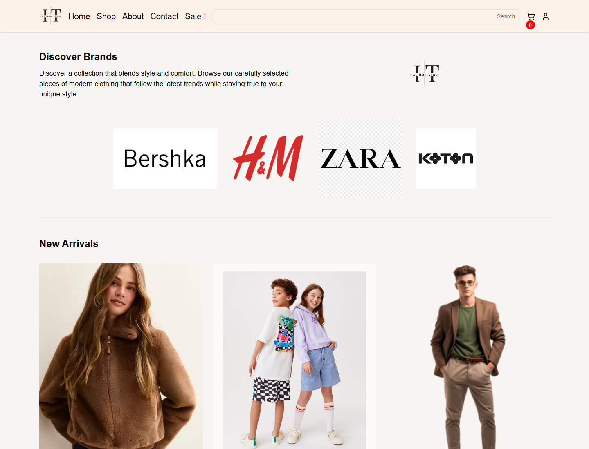
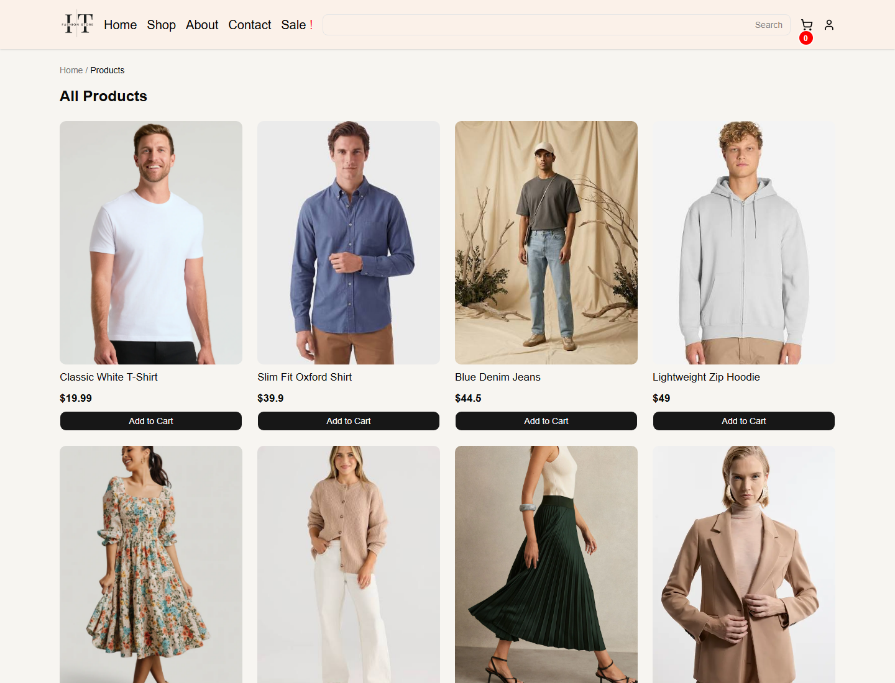

# Modern Boutique

A responsive fashion e-commerce frontend built with React and Vite. Browse collections, filter products by category, inspect product details, choose a size, manage a cart, and try the account and checkout flows.

## Screenshots

| Home, desktop | Catalogue, desktop |
| --- | --- |
|  |  |

Mobile home preview: [screenshots/homepage-mobile.png](screenshots/homepage-mobile.png).

## Requirements

- Node.js 20.19+ or 22.12+
- npm

## Run locally

```bash
npm install
npm run dev
```

Vite prints the local URL, usually `http://localhost:5173`.

## Available commands

| Command | Description |
| --- | --- |
| `npm run dev` | Start the development server with hot reload. |
| `npm run build` | Create a production build in `dist/`. |
| `npm run preview` | Serve the production build locally. |
| `npm run lint` | Check source files with Oxlint. |

## Features

- Responsive shopping pages and category navigation
- Product list and detail views with loading and error feedback
- Cart, login, registration, and checkout interfaces
- Light/dark theme support
- React Router navigation

## Tech stack

React 19, React Router, Vite, Tailwind CSS, shadcn/ui primitives, and Lucide icons.

## API

Product, account, and checkout requests use the Advanzia Education API through `src/api/apiClient.js`. API availability and credentials are required for live data and account actions; the UI displays request failures where those requests are used.

## Deployment

No public live demo is configured yet. Build with `npm run build`, then deploy the generated `dist/` directory to a static host such as GitHub Pages, Netlify, or Vercel. Configure the host to serve `index.html` for client-side routes.

## Future Improvements

- Move API credentials behind a server-side proxy before public deployment.
- Add products to the Kids category when the API provides them.
- Configure a hosted live demo.
